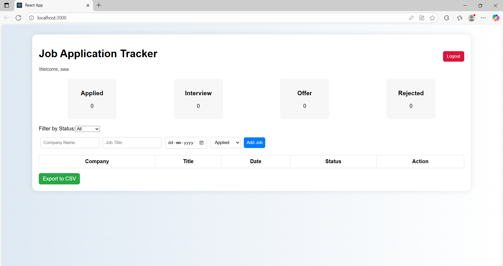
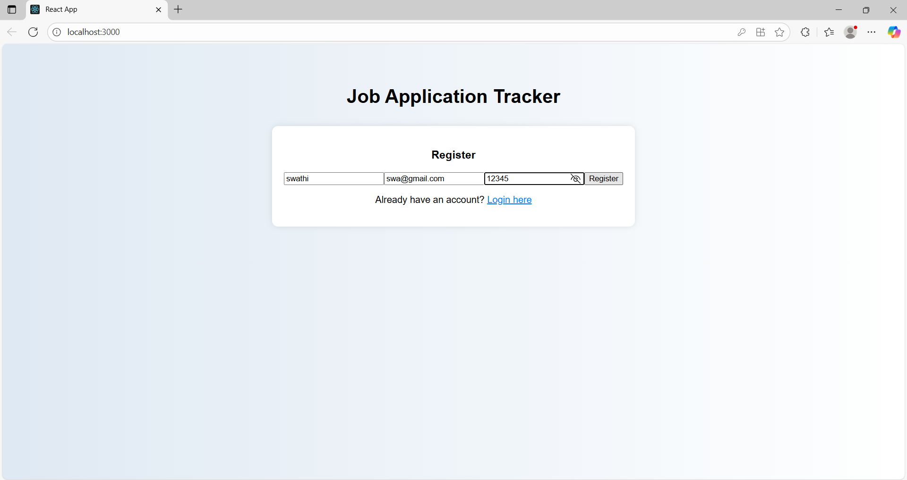
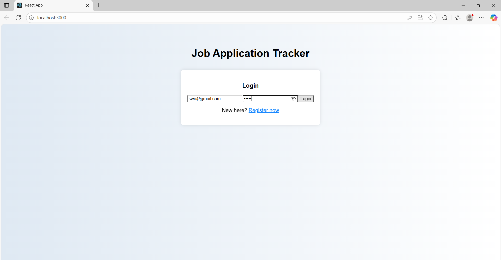
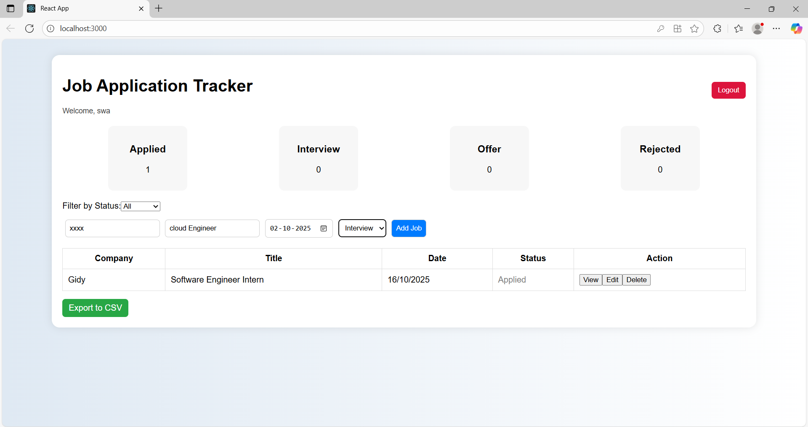
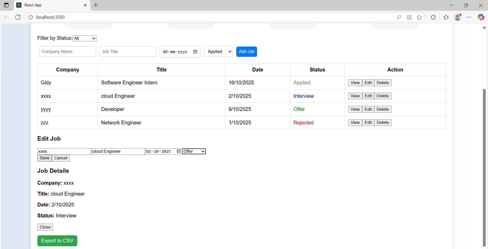
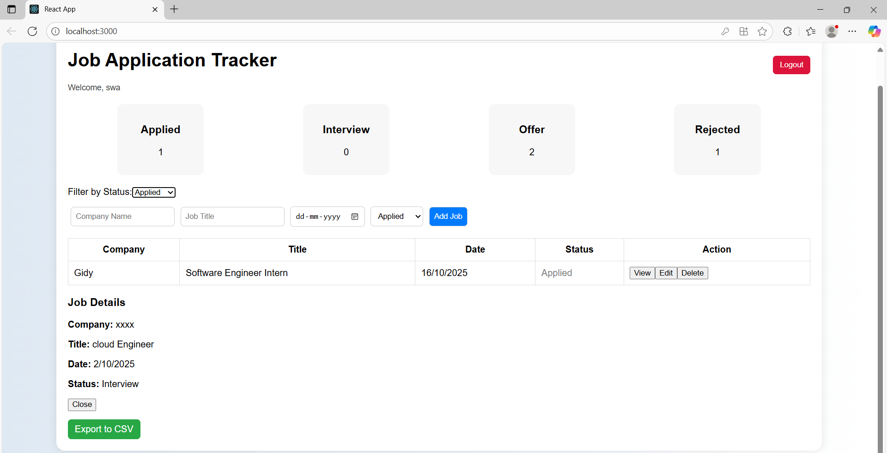
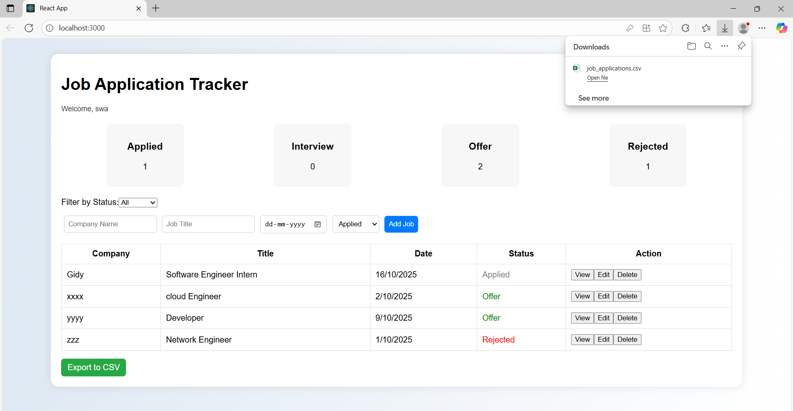

Job Application Tracker (MERN Stack)
Developed by: Swathi S

📘 Project Overview

The Job Application Tracker is a full-stack web application developed using the MERN Stack (MongoDB, Express.js, React.js, Node.js).

This system allows users to register, log in, and manage their job applications efficiently.
Each registered user can add, edit, view, delete, and filter their job applications while keeping their data secure and isolated using JWT-based authentication.

🚀 Key Features

1. User Authentication (Register/Login with JWT)

2. Add new job applications

3. View, Edit, and Delete existing job entries

4. Filter applications by status (Applied, Interview, Offer, Rejected)

5. Dashboard summary displaying counts of each job status

6. Export job data to CSV file (react-csv integration)

7. Form validation for input correctness

8. Simple and elegant blue–white themed UI

🧱 Tech Stack Used
Layer	Technology
Frontend	React.js (Hooks & Functional Components), CSS
Backend	Node.js, Express.js
Database	MongoDB (Mongoose ODM)
Authentication	JSON Web Token (JWT)
Extra	react-csv for data export
⚙️ Installation & Setup
1️⃣ Clone the Repository
git clone  https://github.com/Swathi-2003/job-application-tracker.git
cd job-application-tracker

2️⃣ Backend Setup
cd backend 
npm init -y
npm install express mongoose cors bcryptjs jsonwebtoken nodemon
npm install express
npm install mongoose
npm install cors 
npm run dev (or node server.js)
  
*express → backend framework
*mongoose → connect MongoDB
*cors → allow frontend access
*bcryptjs → password encryption
*jsonwebtoken → login tokens
*nodemon → auto restart server  

✅ The backend will start on: http://localhost:5000

Ensure MongoDB is running locally
Default connection: mongodb://localhost:27017/jobtracker

3️⃣ Frontend Setup

Open a new terminal window:

cd ../frontend
npm create-react-app frontend
npm start

✅ The frontend will start on: http://localhost:3000

🔌 API Endpoints Summary
Method	Endpoint	         Description
POST	/api/users/register	 Register a new   user

POST	/api/users/login	 Login and get JWT token

GET	      /api/jobs	         Get all jobs for logged-in user

POST	/api/jobs	         Add a new job

PUT	/api/jobs/:id	      Update job details

DELETE	/api/jobs/:id   	Delete job by ID

🗂️ Folder Structure
JobApplicationTracker/
--backend
  server.js
  models/
  routes/
  middleware/
 package.json

-- frontend/
   src/
    components/
    App.js
    App.css
    index.js
    package.json

 --screenshots/
   register.png
   login.png
    dashboard.png
    add.png
    edit.png
   filter.png
   exportAsCSV.png

--Licence
--README.md

📸 Screenshots 
Register:

Login:

Dashboard:

Adding:

Edit details:

    
Filter:

Export as csv:
	
	
🧾 License

This project is licensed under the MIT License.
You are free to use, modify, and distribute this software for learning and demonstration purposes.

Copyright © 2025 Swathi S
